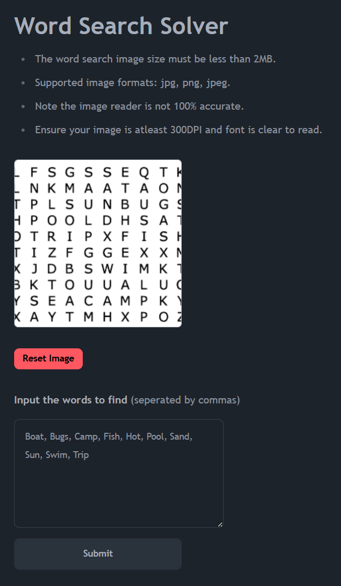
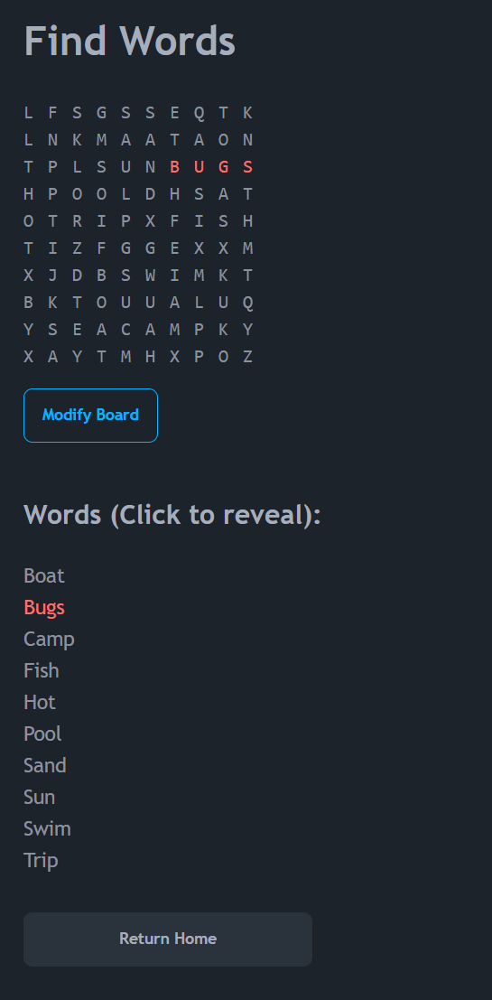

# Word Search Solver

This project is a full-stack application designed to efficiently solve word search puzzles. The app allows users to input a collection of words they are searching for and an image of a word search puzzle. The application uses optical character recognition software and a word search algorithm to generate and display the solution.

## Tech Stack

**Client:** Javascript, HTML, CSS, Blade, Tailwind CSS, DaisyUI

**Server:** PHP, Laravel, Livewire, TesseractOCR

## Screenshots

#### Home Page

#### Solver Page

